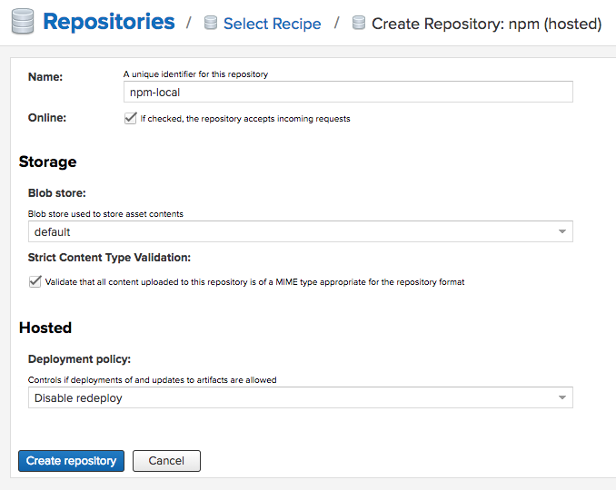

# Private NPM Registry for Development

Setup your own private NPM registry on your local machine 🤓

### Introduction

There's nothing fancy here. Why would you set this up?

- Create own offline cache of official npmjs.org registry
- You are working on a Node.js module and want to test across code bases without publishing your module and without the additional complexity of git submodules.
- You work for a large corporation and have no access to internal infrastructure when working remotely 🙋.

## Setup Nexus 3

The [Nexus repository manager](https://hub.docker.com/r/sonatype/nexus3/) is available for free. So we'll use that.

### 1) Start Nexus in Docker

Inside this project folder, just run:

```
docker-compose up --build
```

Then open [http://localhost:8081](http://localhost:8081) and Nexus is running.

### 2) Login

There's no customization of the image so the default credentials apply:

- username: `admin`
- password: `admin123`

You can change them once you login if you want.

### 3) Add a new NPM Registry

Once logged in as administration, you can **add a _hosted_ npm repository**. This is where we will be publishing our private modules.



In the screenshot, I named my repository `npm-local` so my npm registry URL is `http://localhost:8081/repository/npm-local`.

## Publishing a Private Module

To keep my `package.json` clean, I set the registry using the `NPM_CONFIG_REGISTRY` environment variable.

To publish, you will need to authenticate as well, which is why I use a [`local_publish.sh`](./local_publish.sh) file:

```bash
NPM_CONFIG_REGISTRY=http://localhost:8081/repository/npm-local/ \
NPM_CONFIG_EMAIL=you@example.com \
NPM_CONFIG_ALWAYS_AUTH=true \
NPM_CONFIG__AUTH=YWRtaW46YWRtaW4xMjM= \
	npm publish
```

The authentication token is for the default `admin` user with the `admin123` password. Because this is just for local development, there is no need to change it.

#### Changed Password?

If you changed the admin password, you will need to generate the proper auth token like so:

```bash
$ echo -n 'admin:<PASSWORD>' | openssl base64
```


## Installing a Private Module

Your module probably has dependencies, which means to use the local registry, you also need access to those packages. So you need to add and configure two more registries:

1. Add a new _proxy_ registry named `npm-official` to proxy the official npm registry at https://registry.npmjs.org.

2. Add a new _group_ registry named `npm-all` that combines both `npm-local` and `npm-official`.

So in the end you have 3 registries:

| Registry Type | Description | URL |
|:--|:--|:--|
| group | install from | http://localhost:8081/repository/npm-all/ |
| proxy | mirror | http://localhost:8081/repository/npm-official/ |
| hosted | publish to | http://localhost:8081/repository/npm-local/ |

So finally, to install all modules including private ones, run:

```bash
$ NPM_CONFIG_REGISTRY=http://localhost:8081/repository/npm-all/ npm install
```

### Caveat: `package-lock.json`

If you have a previously generated `package-lock.json` file, npm may complain. And it will change all the URLs if you install from this directory.

As I use this just for testing private modules, I install my packages and then reset my lock file in git, whatever works 🤷‍♀️.

## References

- [Nexus documentation: Node Packaged Modules and npm Registries](https://help.sonatype.com/repomanager3/node-packaged-modules-and-npm-registries)
- [npmjs.com: npm publish](https://docs.npmjs.com/cli/publish)
- [npmjs.com: configuring npm with environment variables](https://docs.npmjs.com/misc/config#environment-variables)
- [Semantic Versioning Spec - prelease versions](https://semver.org/#spec-item-9)
- [Sonatype: Nexus OSS vs Pro](https://www.sonatype.com/nexus-repository-oss-vs.-pro-features)
- [Nexus image on Docker Hub](https://hub.docker.com/r/sonatype/nexus3/)
- [Nexus image on GitHub](https://github.com/sonatype/docker-nexus3)
